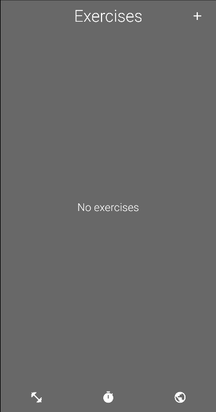
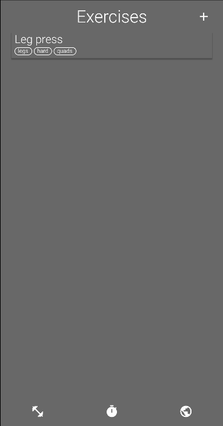
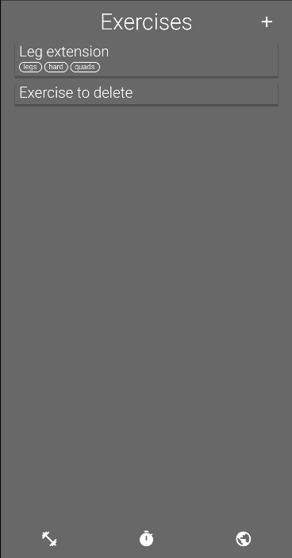
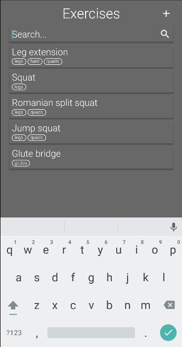
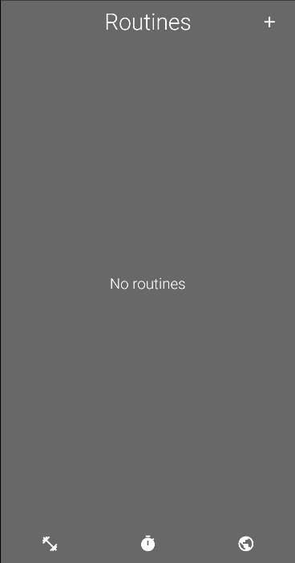
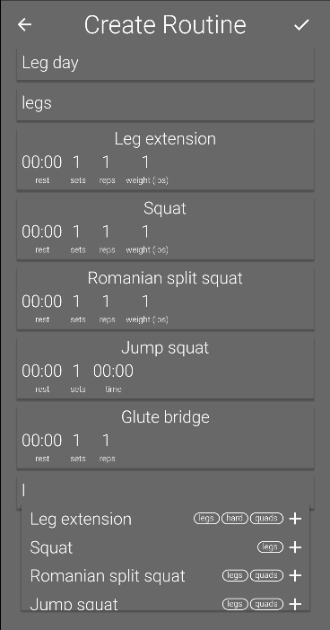
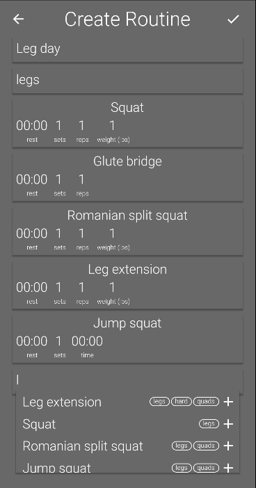
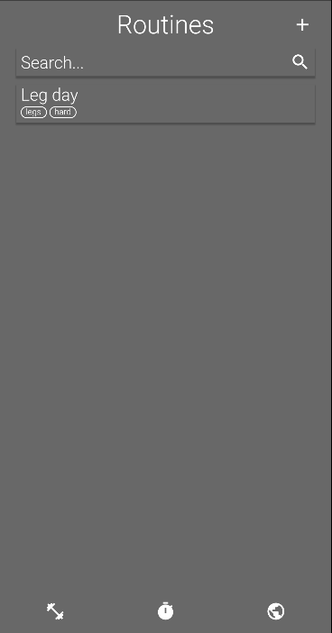

# Modular Exercise Timer
An application for creating fully customizable routines in a modular way. Start by creating exercises and then assemble them into routines in any way you see fit. No more forgetting what rep you're on or what exercises you do on leg day; it's all here, all in one place.

## Exercises
### Create 

- Add a description to help you remember key form tips
- Include tags for easy searchability 
- Select whether the exercise is for time or for reps, weighted or unweighted

### Edit

- Modify any of the exercise's fields and changes will apply to all routines that exercise is in

### Delete

- Delete any exercise by swiping left

### Search

- Search through both names and tags to easily locate the exercise you're looking for

## Routines
### Create

- Create a routine composed of exercises from your exercise library

- Reorder exercise position by dragging up and down the list

- Set the desired weight, number of sets and reps, work time, and rest time for each exercise allowing for the creation of many different routines from only a few exercises

### Start

- Start your routine with the click of the button. Just worry about working out, all tracking is done by the app

## What's next?
In future versions I'll be looking to add online routine sharing. That way, you won't need to scour through the internet transcribing various routines; they'll all be available with the single tap. I'll also be adding more robust progress tracking with graph representations 